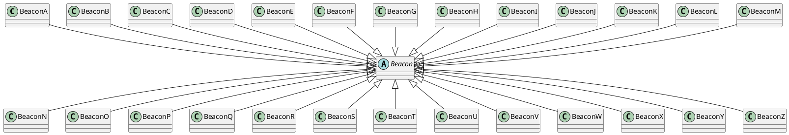

GitHub PagesによるHTMLドキュメント
================================

# 概要

この文章はダミーです。文字の大きさ、量、字間、行間等を確認するために入れています。この文章はダミーです。文字の大きさ、量、字間、行間等を確認するために入れています。

## 他ページへのリンク

* [doc1](./doc1.html)
* [doc2](./sub/doc2.html)

# 解説

この文章はダミーです。文字の大きさ、量、字間、行間等を確認するために入れています。

この文章はダミーです。文字の大きさ、量、字間、行間等を確認するために入れています。この文章はダミーです。文字の大きさ、量、字間、行間等を確認するために入れています。この文章はダミーです。文字の大きさ、量、字間、行間等を確認するために入れています。この文章はダミーです。文字の大きさ、量、字間、行間等を確認するために入れています。この文章はダミーです。文字の大きさ、量、字間、行間等を確認するために入れています。

この文章はダミーです。文字の大きさ、量、字間、行間等を確認するために入れています。この文章はダミーです。文字の大きさ、量、字間、行間等を確認するために入れています。この文章はダミーです。文字の大きさ、量、字間、行間等を確認するために入れています。

この文章はダミーです。文字の大きさ、量、字間、行間等を確認するために入れています。この文章はダミーです。文字の大きさ、量、字間、行間等を確認するために入れています。この文章はダミーです。文字の大きさ、量、字間、行間等を確認するために入れています。この文章はダミーです。文字の大きさ、量、字間、行間等を確認するために入れています。この文章はダミーです。文字の大きさ、量、字間、行間等を確認するために入れています。

